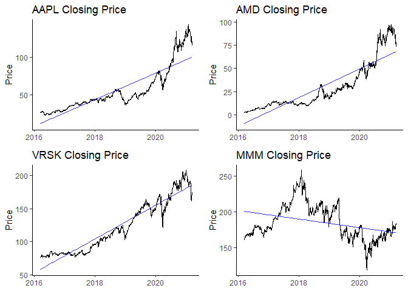
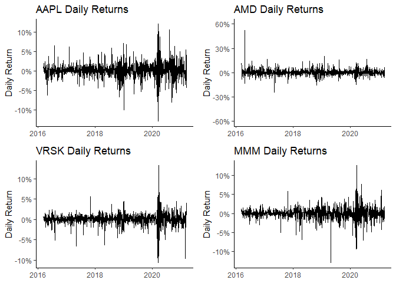
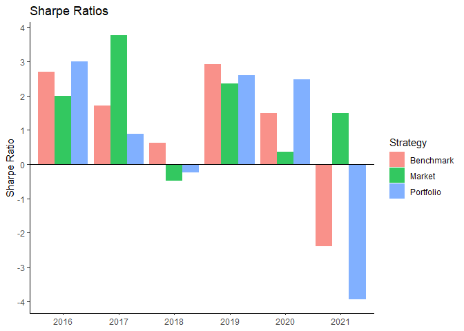
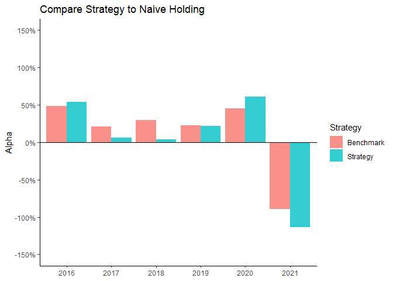
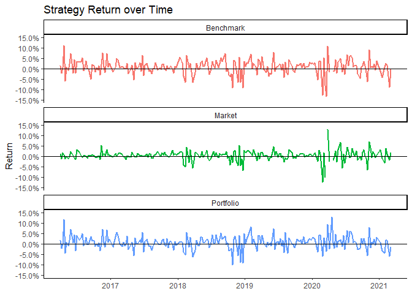
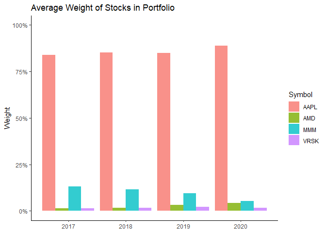
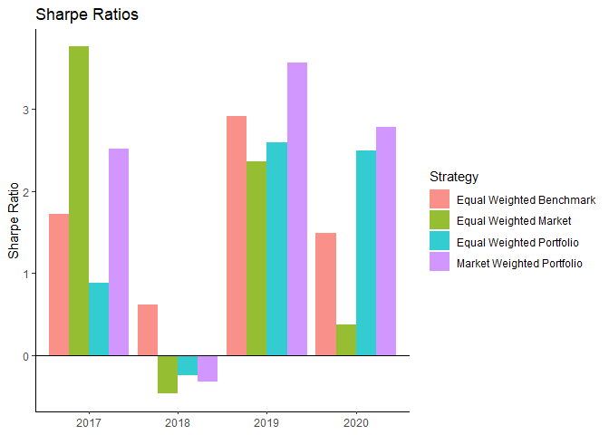

Project 2
================
Matt B
3/10/2021

## Create Data

``` r
# uncomment line to install pacman
# install.packages("pacman")
pacman::p_load(tidyverse, lubridate, gridExtra)
theme_set(theme_classic())
```

``` r
# stocks
aapl <- read_csv("AAPL.csv")
```

    ## Rows: 1258 Columns: 7

    ## -- Column specification --------------------------------------------------------
    ## Delimiter: ","
    ## dbl  (6): Open, High, Low, Close, Adj Close, Volume
    ## date (1): Date

    ## 
    ## i Use `spec()` to retrieve the full column specification for this data.
    ## i Specify the column types or set `show_col_types = FALSE` to quiet this message.

``` r
amd <- read_csv("AMD.csv")
```

    ## Rows: 1258 Columns: 7

    ## -- Column specification --------------------------------------------------------
    ## Delimiter: ","
    ## dbl  (6): Open, High, Low, Close, Adj Close, Volume
    ## date (1): Date

    ## 
    ## i Use `spec()` to retrieve the full column specification for this data.
    ## i Specify the column types or set `show_col_types = FALSE` to quiet this message.

``` r
vrsk <- read_csv("VRSK.csv")
```

    ## Rows: 1258 Columns: 7

    ## -- Column specification --------------------------------------------------------
    ## Delimiter: ","
    ## dbl  (6): Open, High, Low, Close, Adj Close, Volume
    ## date (1): Date

    ## 
    ## i Use `spec()` to retrieve the full column specification for this data.
    ## i Specify the column types or set `show_col_types = FALSE` to quiet this message.

``` r
mmm <- read_csv("MMM.csv")
```

    ## Rows: 1258 Columns: 7

    ## -- Column specification --------------------------------------------------------
    ## Delimiter: ","
    ## dbl  (6): Open, High, Low, Close, Adj Close, Volume
    ## date (1): Date

    ## 
    ## i Use `spec()` to retrieve the full column specification for this data.
    ## i Specify the column types or set `show_col_types = FALSE` to quiet this message.

``` r
# market
djia <- read_csv("DJIA.csv")
```

    ## Rows: 1261 Columns: 5

    ## -- Column specification --------------------------------------------------------
    ## Delimiter: ","
    ## chr (1): Date
    ## dbl (4): Open, High, Low, Close

    ## 
    ## i Use `spec()` to retrieve the full column specification for this data.
    ## i Specify the column types or set `show_col_types = FALSE` to quiet this message.

``` r
grid.arrange(
  ggplot(aapl, aes(x = Date, y = Close)) +
    geom_line() +
    stat_smooth(geom = "line", alpha = 0.8, method = "lm", color = "blue") +
    labs(title = "AAPL Closing Price", y = "Price", x = NULL),
  ggplot(amd, aes(x = Date, y = Close)) +
    geom_line() +
    stat_smooth(geom = "line", alpha = 0.8, method = "lm", color = "blue") +
    labs(title = "AMD Closing Price", y = "Price", x = NULL),
  ggplot(vrsk, aes(x = Date, y = Close)) +
    geom_line() +
    stat_smooth(geom = "line", alpha = 0.8, method = "lm", color = "blue") +
    labs(title = "VRSK Closing Price", y = "Price", x = NULL),
  ggplot(mmm, aes(x = Date, y = Close)) +
    geom_line() +
    stat_smooth(geom = "line", alpha = 0.8, method = "lm", color = "blue") +
    labs(title = "MMM Closing Price", y = "Price", x = NULL),
  nrow = 2
)
```

    ## `geom_smooth()` using formula 'y ~ x'
    ## `geom_smooth()` using formula 'y ~ x'
    ## `geom_smooth()` using formula 'y ~ x'
    ## `geom_smooth()` using formula 'y ~ x'

<!-- -->

``` r
grid.arrange(
  ggplot(aapl, aes(x = Date, y = Close/lag(Close) - 1)) +
    geom_line() +
    labs(title = "AAPL Daily Returns", y = "Daily Return", x = NULL) +
    scale_y_continuous(labels = scales::percent_format(accuracy = 1)),
  ggplot(amd, aes(x = Date, y = Close/lag(Close) - 1)) +
    geom_line() +
    labs(title = "AMD Daily Returns", y = "Daily Return", x = NULL) +
    scale_y_continuous(labels = scales::percent_format(accuracy = 1), limits = c(-.6, .6)),
  ggplot(vrsk, aes(x = Date, y = Close/lag(Close) - 1)) +
    geom_line() +
    labs(title = "VRSK Daily Returns", y = "Daily Return", x = NULL) +
    scale_y_continuous(labels = scales::percent_format(accuracy = 1)),
  ggplot(mmm, aes(x = Date, y = Close/lag(Close) - 1)) +
    geom_line() +
    labs(title = "MMM Daily Returns", y = "Daily Return", x = NULL) +
    scale_y_continuous(labels = scales::percent_format(accuracy = 1)),
  nrow = 2
)
```

    ## Warning: Removed 1 row(s) containing missing values (geom_path).

    ## Warning: Removed 1 row(s) containing missing values (geom_path).

    ## Warning: Removed 1 row(s) containing missing values (geom_path).

    ## Warning: Removed 1 row(s) containing missing values (geom_path).

<!-- -->

``` r
trading_strategy <- function(input_data){
  stock <- input_data %>% 
    mutate(weekday = as.character(wday(as.Date(Date, format = "%m/%d/%Y"), label = TRUE))) %>% 
    filter(weekday == "Mon" | weekday == "Fri")
  stock <- stock %>% 
    filter(lag(weekday) != weekday)
  
  stock$investment_return_strategy <- 0
  stock$holding <- 0
  stock$decision <- NA
  
  for (i in 1:nrow(stock)) {
    day_of_week <- stock$weekday[i]
    
    #signals
    if (day_of_week == "Mon") {
      decision = "Buy"
    }
    else if (day_of_week == "Fri") {
      decision = "Sell"
    }
    
    
    # holding status
    if (decision == "Sell") {
      holding = 0
    }
    else if (decision == "Buy") {
      holding = 1
    }
    
    # calculate investment return
    if (day_of_week == "Mon") {
      investment_return_strategy = 0
    }
    else if (day_of_week == "Fri") {
      investment_return_strategy = stock$Close[i] / stock$Open[i - 1] - 1
    }
    
    stock$investment_return_strategy[i] <- investment_return_strategy
    stock$holding[i] <- holding
    stock$decision[i] <- decision
  }
  output <- stock %>% 
    select(Date, weekday, investment_return_strategy, Close)
}
```

``` r
benchmark_strategy <- function(input_data){
  stock <- input_data %>% 
    filter(weekday == "Fri") %>% 
    mutate(investment_return_benchmark = Close/lag(Close) - 1) %>% 
    filter(!is.na(investment_return_benchmark)) %>% 
    select(-Close)
}
```

``` r
aapl_trade <- trading_strategy(aapl)
amd_trade <- trading_strategy(amd )
mmm_trade <- trading_strategy(mmm)
vrsk_trade <- trading_strategy(vrsk)
```

``` r
aapl_complete <- benchmark_strategy(aapl_trade) %>% 
  mutate(Symbol = "AAPL")
amd_complete <- benchmark_strategy(amd_trade) %>% 
  mutate(Symbol = "AMD")
mmm_complete <- benchmark_strategy(mmm_trade) %>% 
  mutate(Symbol = "MMM")
vrsk_complete <- benchmark_strategy(vrsk_trade)%>% 
  mutate(Symbol = "VRSK")
```

``` r
stacked_trade <- rbind(aapl_complete, amd_complete, mmm_complete, vrsk_complete) %>% 
  mutate(Symbol = factor(Symbol))
```

``` r
portfolio <- stacked_trade %>% 
  group_by(Date) %>%
  summarise(portfolio_return = mean(investment_return_strategy), benchmark_return = mean(investment_return_benchmark))
```

``` r
# create market data
djia <- djia %>% 
  mutate(Date = as.Date(Date, format = "%m/%d/%Y")) %>% 
  mutate(weekday = wday(Date, label = TRUE)) %>% 
  filter(weekday == "Fri" & Date >= "2016-03-18") %>% 
  mutate(market_return = Close/lag(Close) - 1) %>% 
  filter(!is.na(market_return))
```

``` r
portfolio_full <- portfolio %>% 
  left_join(djia, by = "Date") %>% 
  select(Date, portfolio_return, benchmark_return, market_return)
portfolio_full$Year <- year(portfolio_full$Date)
```

## Evaluate

### Sharpe Ratio

``` r
sharpe_by_year <- portfolio_full %>%
  group_by(Year) %>%
  summarise(sharpe_portfolio = sqrt(52) * mean(portfolio_return) / sd(portfolio_return),
            sharpe_benchmark = sqrt(52) * mean(benchmark_return) / sd(benchmark_return),
            sharpe_market = sqrt(52) * mean(market_return) / sd(market_return))
print(sharpe_by_year)
```

    ## # A tibble: 6 x 4
    ##    Year sharpe_portfolio sharpe_benchmark sharpe_market
    ##   <dbl>            <dbl>            <dbl>         <dbl>
    ## 1  2016            3.00             2.70          2.00 
    ## 2  2017            0.885            1.72          3.76 
    ## 3  2018           -0.249            0.619        -0.474
    ## 4  2019            2.59             2.92          2.36 
    ## 5  2020            2.49             1.49          0.368
    ## 6  2021           -3.95            -2.40          1.48

``` r
sharpe_by_year %>% 
  rename("Portfolio" = "sharpe_portfolio",
         "Market" = "sharpe_market", 
         "Benchmark" = "sharpe_benchmark") %>% 
  pivot_longer(!Year)  %>% 
  ggplot(aes(x = factor(Year), y = value, fill = name)) +
    geom_col(position = "dodge", alpha = .8) +
    labs(x = NULL, y = "Sharpe Ratio", title = "Sharpe Ratios", fill = "Strategy") +
    geom_hline(yintercept = 0) +
    scale_y_continuous(breaks = c(-4, -3, -2, -1, 0, 1, 2, 3, 4))
```

<!-- -->

``` r
sharpe_total <- portfolio_full %>% 
  summarise(sharpe_portfolio = sqrt(52) * mean(portfolio_return) / sd(portfolio_return),
            sharpe_benchmark = sqrt(52) * mean(benchmark_return) / sd(benchmark_return),
            sharpe_market = sqrt(52) * mean(market_return) / sd(market_return))
print(sharpe_total)
```

    ## # A tibble: 1 x 3
    ##   sharpe_portfolio sharpe_benchmark sharpe_market
    ##              <dbl>            <dbl>         <dbl>
    ## 1             1.45             1.51         0.735

### Jensen’s Alpha

#### Based on Trading Strategy

``` r
alpha_yearly_strategy <- portfolio_full %>% 
  group_by(Year) %>% 
  summarise(alpha = 52 * coef(lm(portfolio_return ~ market_return))[1])
print(alpha_yearly_strategy)
```

    ## # A tibble: 6 x 2
    ##    Year   alpha
    ##   <dbl>   <dbl>
    ## 1  2016  0.543 
    ## 2  2017  0.0595
    ## 3  2018  0.0364
    ## 4  2019  0.222 
    ## 5  2020  0.613 
    ## 6  2021 -1.14

``` r
alpha_strategy <- portfolio_full %>% 
  summarise(alpha = 52 * coef(lm(portfolio_return ~ market_return))[1])
print(alpha_strategy)
```

    ## # A tibble: 1 x 1
    ##   alpha
    ##   <dbl>
    ## 1 0.236

#### Based on Naive Holding

``` r
alpha_yearly_benchmark <- portfolio_full %>% 
  group_by(Year) %>% 
  summarise(alpha = 52 * coef(lm(benchmark_return ~ market_return))[1])
print(alpha_yearly_benchmark)
```

    ## # A tibble: 6 x 2
    ##    Year  alpha
    ##   <dbl>  <dbl>
    ## 1  2016  0.485
    ## 2  2017  0.208
    ## 3  2018  0.299
    ## 4  2019  0.229
    ## 5  2020  0.449
    ## 6  2021 -0.897

``` r
alpha_benchmark <- portfolio_full %>%  
  summarise(alpha = 52 * coef(lm(benchmark_return ~ market_return))[1])
print(alpha_benchmark)
```

    ## # A tibble: 1 x 1
    ##   alpha
    ##   <dbl>
    ## 1 0.259

``` r
as.data.frame(c(alpha_yearly_strategy, alpha_yearly_benchmark)) %>% 
  rename("alpha_strategy" = "alpha",
         "alpha_benchmark" = "alpha.1") %>% 
  select(-Year.1) %>% 
  pivot_longer(!Year) %>% 
  mutate(name = ifelse(name == "alpha_strategy", "Strategy", "Benchmark")) %>% 
  ggplot(aes(x = factor(Year), y = value, fill = name)) +
    geom_col(position = "dodge", alpha = .8) +
    geom_hline(yintercept = 0) +
    labs(x = NULL, y = "Alpha", title = "Compare Strategy to Naive Holding", fill = "Strategy") +
    scale_y_continuous(labels = scales::percent, limits = c(-1.5, 1.5), breaks = c(-1.5, -1, -.5, 0, .5, 1, 1.5)) 
```

<!-- -->

``` r
portfolio_full %>% 
  select(-Year) %>% 
  rename("Portfolio" = "portfolio_return",
         "Benchmark" = "benchmark_return",
         "Market" = "market_return") %>% 
  pivot_longer(!Date) %>% 
  ggplot(aes(x = Date, y = value, color = name)) +
    geom_line(size = 1.01) +
    geom_hline(yintercept = 0) +
    scale_y_continuous(labels = scales::percent, limits = c(-.15, .15), 
                       breaks = c(-.15, -.10, -.05, 0, .05, .10, .15)) +
    labs(x = NULL, y = "Return", title = "Strategy Return over Time", color = NULL) +
    theme(legend.position = "none") +
    facet_wrap(~ name, nrow = 3)
```

<!-- -->

## Market Weight Portfolio

``` r
market_value <- function(stock, shares_2017, shares_2018, shares_2019, shares_2020){
  stock %>% 
    filter(year(Date) %in% c(2017, 2018, 2019, 2020)) %>% 
    mutate(shares_outstanding = case_when(year(Date) == 2017 ~ shares_2017,
                                          year(Date) == 2018 ~ shares_2018,
                                          year(Date) == 2019 ~ shares_2019,
                                          year(Date) == 2020 ~ shares_2020))
}
```

``` r
# data used here includes the return using the strategy
aapl_market_weight <- aapl_trade %>% 
  market_value(shares_2017 = 20504804, shares_2018 = 19019944, shares_2019 = 17772944, shares_2020 = 16976763) %>% 
  mutate(Symbol = "AAPL")
amd_market_weight <- amd_trade %>% 
  market_value(shares_2017 = 967000, shares_2018 = 1005000, shares_2019 = 1170000, shares_2020 = 1211000) %>% 
  mutate(Symbol = "AMD")
mmm_market_weight <- mmm_trade %>% 
  market_value(shares_2017 = 594884, shares_2018 = 576575, shares_2019 = 575185, shares_2020 = 577750) %>% 
  mutate(Symbol = "MMM")
vrsk_market_weight <- vrsk_trade %>% 
  market_value(shares_2017 = 164879, shares_2018 = 163970, shares_2019 = 163162, shares_2020 = 162818) %>% 
  mutate(Symbol = "VRSK")
```

``` r
portfolio_market_weight <- rbind(aapl_market_weight, amd_market_weight, mmm_market_weight, vrsk_market_weight) %>% 
  filter(wday(Date, label = TRUE) == "Fri") %>% 
  mutate(stock_market_value = Close * shares_outstanding)
```

``` r
total_portfolio_market_value <- portfolio_market_weight %>% 
  group_by(Date) %>% 
  summarise(total_market_value = sum(stock_market_value)) %>% 
  distinct(Date, total_market_value)
portfolio_market_weight <- portfolio_market_weight %>% 
  left_join(total_portfolio_market_value, by = "Date")
```

``` r
portfolio_market_weight <- portfolio_market_weight %>% 
  mutate(stock_weight = stock_market_value/total_market_value)
```

``` r
weighted_return <- portfolio_market_weight %>% 
  group_by(Date, Symbol) %>% 
  summarise(weighted_return = stock_weight * investment_return_strategy)
```

    ## `summarise()` has grouped output by 'Date'. You can override using the `.groups` argument.

``` r
portfolio_market_weight <- portfolio_market_weight %>% 
  left_join(weighted_return, by = c("Date", "Symbol"))
```

``` r
portfolio_market_weight %>% 
  group_by(year(Date), Symbol) %>% 
  summarize(mean_weight = mean(stock_weight)) %>% 
  rename("Year" = `year(Date)`) %>% 
  ggplot(aes(x = Year, y = mean_weight, fill = Symbol)) +
    geom_col(position = "dodge", alpha = 0.8) +
    labs(x = NULL, y = "Weight", title = "Average Weight of Stocks in Portfolio") +
    scale_y_continuous(labels = scales::percent, limits = c(0, 1))
```

    ## `summarise()` has grouped output by 'year(Date)'. You can override using the `.groups` argument.

<!-- -->

``` r
market_weight_return <- portfolio_market_weight %>% 
  group_by(Date) %>% 
  summarise(market_weighted_return = sum(weighted_return))

portfolio_market_weight <- portfolio_market_weight <- portfolio_market_weight %>% 
  left_join(market_weight_return, by = "Date") %>% 
  filter(Symbol == "AAPL") %>% 
  select(-c(weekday, Close, shares_outstanding, Symbol, stock_market_value, stock_weight, weighted_return,
            investment_return_strategy, total_market_value))
```

``` r
market_weight_sharpe_by_year <- portfolio_market_weight %>%
  group_by(year(Date)) %>%
  summarise(sharpe_market_weight_portfolio = sqrt(52) * mean(market_weighted_return) / sd(market_weighted_return)) %>%   rename("Year" = `year(Date)`)

market_weight_sharpe_total <- portfolio_market_weight %>% 
  summarise(sharpe_market_weight_portfolio = sqrt(52) * mean(market_weighted_return) / sd(market_weighted_return))

print(market_weight_sharpe_by_year)
```

    ## # A tibble: 4 x 2
    ##    Year sharpe_market_weight_portfolio
    ##   <dbl>                          <dbl>
    ## 1  2017                          2.52 
    ## 2  2018                         -0.320
    ## 3  2019                          3.56 
    ## 4  2020                          2.78

``` r
print(market_weight_sharpe_total)
```

    ## # A tibble: 1 x 1
    ##   sharpe_market_weight_portfolio
    ##                            <dbl>
    ## 1                           1.82

``` r
all_yearly_sharpe_ratios <- sharpe_by_year %>% 
  semi_join(market_weight_sharpe_by_year) %>% 
  left_join(market_weight_sharpe_by_year, by = "Year")
```

    ## Joining, by = "Year"

``` r
all_total_sharpe_ratios <- portfolio_full %>% 
  filter(year(Date) %in% c(2017, 2018, 2019, 2020)) %>% 
  summarise(sharpe_portfolio = sqrt(52) * mean(portfolio_return) / sd(portfolio_return),
            sharpe_benchmark = sqrt(52) * mean(benchmark_return) / sd(benchmark_return),
            sharpe_market = sqrt(52) * mean(market_return) / sd(market_return)) %>% 
  cbind(market_weight_sharpe_total)

print(all_yearly_sharpe_ratios)
```

    ## # A tibble: 4 x 5
    ##    Year sharpe_portfolio sharpe_benchmark sharpe_market sharpe_market_weight_po~
    ##   <dbl>            <dbl>            <dbl>         <dbl>                    <dbl>
    ## 1  2017            0.885            1.72          3.76                     2.52 
    ## 2  2018           -0.249            0.619        -0.474                   -0.320
    ## 3  2019            2.59             2.92          2.36                     3.56 
    ## 4  2020            2.49             1.49          0.368                    2.78

``` r
print(all_total_sharpe_ratios)
```

    ##   sharpe_portfolio sharpe_benchmark sharpe_market
    ## 1         1.346809         1.459624     0.6137418
    ##   sharpe_market_weight_portfolio
    ## 1                       1.818195

``` r
all_yearly_sharpe_ratios %>% 
  rename("Equal Weighted Portfolio" = "sharpe_portfolio",
         "Equal Weighted Market" = "sharpe_market", 
         "Equal Weighted Benchmark" = "sharpe_benchmark",
         "Market Weighted Portfolio" = "sharpe_market_weight_portfolio") %>% 
  pivot_longer(!Year)  %>% 
  ggplot(aes(x = factor(Year), y = value, fill = name)) +
    geom_col(position = "dodge", alpha = .8) +
    labs(x = NULL, y = "Sharpe Ratio", title = "Sharpe Ratios", fill = "Strategy") +
    geom_hline(yintercept = 0) +
    scale_y_continuous(breaks = c(-4, -3, -2, -1, 0, 1, 2, 3, 4))
```

<!-- -->
